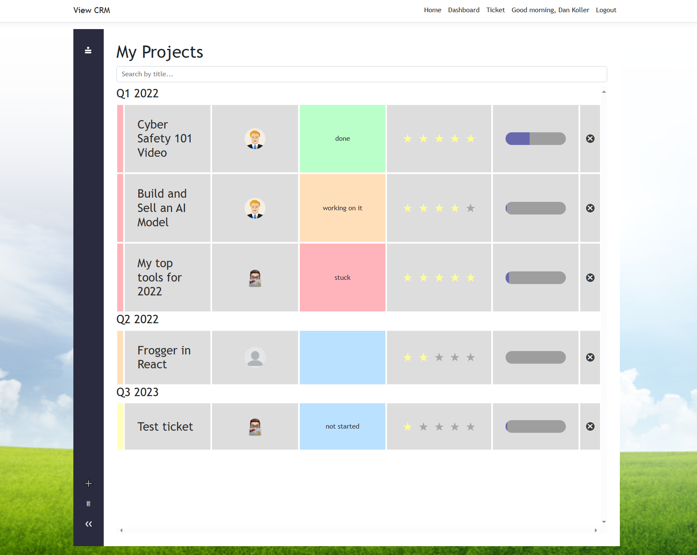

# View CRM

View is a customer relationship management tool that allows users to track their projects. Users can create, edit, and delete projects and clients. Users can also add notes to projects.

View supports user authentication and authorization and basic updates to the users profile. Users can also view all of their projects and clients on their dashboard.

    

## Installation

See the [installation instructions](docs/install.md) for install options for your operating system.

## Usage

After setting up the project, installing the dependencies and database, you can start the project by executing the start scripts, as there are multiple projects that need to be started.

-   Windows: `.\start.bat`
-   Linux: `./start.sh`

By default, the application is running on port 5000. You will be redirected though to port 5001, since HTTPS is enabled by default. After that, the application starts the SPA proxy on port 44440. This is the port you will use to access the application.

On the landing page, you can register a new account or login with an existing one. The first user you register will be an administrator, even though there is no difference between a regular user and an administrator at the moment.

The app itself is pretty self explanatory. You can create tickets representing your projects. When you delete a projects, they are "tossed" into the trash bin, where you can restore them or delete them permanently. Only the owner of the ticket can delete it permanently.

## Contributing

Contributions are welcome! Please open an issue or submit a pull request if you have any ideas for improvements.

## License

This project is licensed under the MIT License - see the [LICENSE](LICENSE) file for details.
